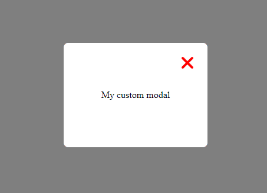

# Custom Modal

## 🚀 Getting Started

Install This package :
```
npm install reactjs-custom-modal
```



## ✨ Example:
```js
import React, { useState } from 'react';
import { Modal } from "reactjs-custom-modal";

function App() {
  const [isModalOpen, setIsModalOpen] = useState(false);

  const openModal = () => {
    setIsModalOpen(true);
  };

  const closeModal = () => {
    setIsModalOpen(false);
  };

  return (
    <div>
      <button onClick={openModal}>Open Modal</button>
      <Modal text="Example Text" isOpen={isModalOpen} onClose={closeModal} textColor="#fff" backgroundColor="#157846" iconColor="red"/>
    </div>
  );
}

export default App;
```

## 📌 Props

| Prop              | Description                                   | Default     |     
|-------------------|-----------------------------------------------|-------------|
| text              | The text that will be displayed in the modal |             |
| isOpen            | A boolean that will open the modal if true   |             |
| onClose           | The function that will close the modal       |             |
| textColor         | The color of the text in the modal           | #fff (white)|
| backgroundColor   | The background color of the modal             | #157846 (green) |
| iconColor   | The color of the icon            | red |